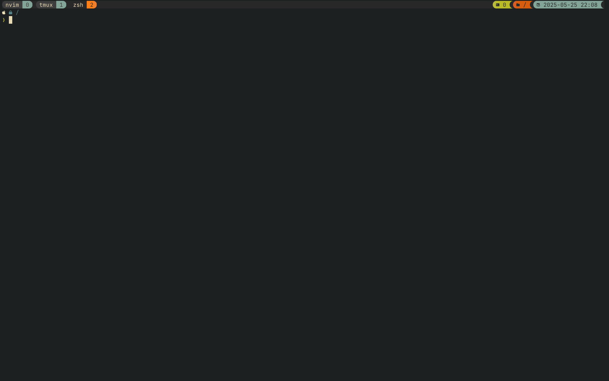

<p align="center">
  
</p>

# Tmux Setup

A minimal yet functional `tmux` setup focused on **productivity**, **Vim-style navigation**, and a **clean gruvbox theme**.

## Features

- Reload config with `<prefix> + r`
- Vim-style keybindings for navigation and copy mode
- Mouse support and smooth scrolling
- Intuitive window splitting:
  - `<prefix> + .` for horizontal split
  - `<prefix> + ,` for vertical split
- Shift + ← / → to cycle through windows
- Mouse support
- Gruvbox theme with custom separators
- Plugin support via [TPM](https://github.com/tmux-plugins/tpm)

## Keybindings

| Action                    | Keybinding                 |
| ------------------------- | -------------------------- |
| Reload config             | `<prefix> + r`             |
| Copy mode                 | `<prefix> + [`             |
| Copy to clipboard         | `y` (in copy-mode)         |
| Split window (vertical)   | `<prefix> + ,`             |
| Split window (horizontal) | `<prefix> + .`             |
| Move pane (Vim-style)     | `<prefix> + h / j / k / l` |
| Next/Prev window          | `Shift + → / ←`            |

## Theme

This config uses [`tmux-gruvbox`](https://github.com/z3z1ma/tmux-gruvbox) with the **dark** variant and custom separators.

## Requirements

- tmux ≥ 3.2
- nerd fonts (for icons/separators)
- Clipboard tool (e.g., pbcopy, xclip, or wl-copy)

## Plugins

Managed with [TPM](https://github.com/tmux-plugins/tpm):

- [`tmux-plugins/tpm`](https://github.com/tmux-plugins/tpm) — Plugin manager
- [`christoomey/vim-tmux-navigator`](https://github.com/christoomey/vim-tmux-navigator) — Seamless Vim ↔ tmux navigation
- [`z3z1ma/tmux-gruvbox`](https://github.com/z3z1ma/tmux-gruvbox) — Beautiful gruvbox status line

## Installation

1. Install Tmux:

```sh
brew install tmux
```

2. Clone TPM:

```sh
git clone https://github.com/tmux-plugins/tpm ~/.tmux/plugins/tpm
```

3. Clone this repo into your dotfile directory:

```sh
git clone git@github.com:daprabowo/tmux-config.git
```

4. Link Tmux config file to $HOME directory:

```sh
make link
```

5. Open or restart Tmux and enjoy!

```sh-session
<prefix> + I
```

## Screenshot



## License

MIT License. Feel free to use, fork, and modify.
